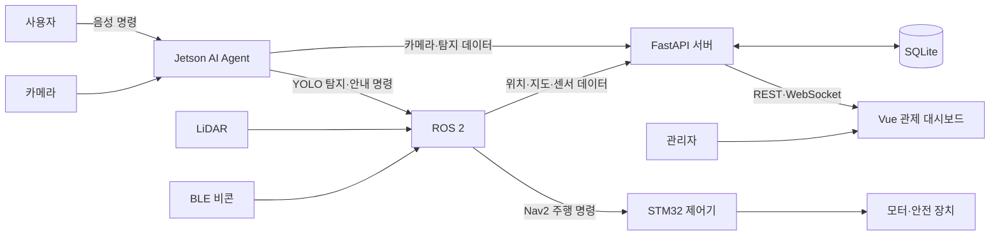

<div align="center">

# Lumi

### 시각장애인의 안전한 실내 보행을 돕는 AI 동행 로봇

음성으로 목적지를 안내하고, 주변 장애물을 인식하며,<br>
관리자 관제 시스템과 실시간으로 연결되는 지능형 이동 보조 플랫폼입니다.

</div>

## 프로젝트 소개

시각장애인은 낯선 실내 공간에서 목적지를 찾거나 갑작스러운 장애물에 대응할 때 많은 어려움을 겪습니다. Lumi는 사용자의 음성 명령을 이해하고 자율주행으로 이동을 지원하며, 위험 상황에서는 즉시 정지하거나 관리자에게 도움을 요청합니다.

로봇의 카메라, LiDAR, BLE 비콘, SLAM 데이터를 하나의 시스템으로 통합했습니다. 사용자는 음성으로 로봇과 상호작용하고, 관리자는 웹 대시보드에서 로봇의 위치와 상태, 카메라 영상, 안전 이벤트를 실시간으로 확인할 수 있습니다.

## 핵심 기능

### 음성 기반 안내

- “하이 루미” 웨이크 워드 인식
- Whisper 기반 한국어 음성 인식
- LLM을 활용한 자연어 질의 및 후속 대화
- 목적지 안내와 주변 상황에 대한 음성 응답
- TTS를 통한 실시간 안내 및 위험 경고

### AI 장애물 인식

- YOLO와 TensorRT를 활용한 실시간 객체 탐지
- ByteTrack 기반 객체 추적
- 청소 중 표지판 등 특정 위험물 전용 모델 병행
- 탐지 결과와 카메라 영상을 관제 서버 및 ROS 2로 전달

### 자율주행과 실내 측위

- ROS 2 Nav2 기반 목적지 및 경유지 주행
- Cartographer SLAM과 LiDAR 기반 지도 생성 및 위치 추정
- BLE 비콘을 활용한 구역 인식과 도착 판정
- STM32 제어기로 속도 명령을 전달하는 주행 제어 구조

### 안전 대응

- 충돌, 낙상, 비상 정지, 통신 끊김, 배터리 부족 이벤트 관리
- 이동 경로 차단과 로봇 고착 상황에서 관리자 개입 요청
- 위험물 연속 감지 시 즉각적인 음성 경고
- 오래된 센서 데이터를 자동으로 만료해 잘못된 상태 표시 방지

### 실시간 관제

- 로봇 위치, 방향, 주행 상태와 목적지를 지도에 표시
- LiDAR 스캔과 AI 탐지 결과 시각화
- Jetson 카메라 영상 실시간 중계
- 동행 세션, 장소, 비콘, 관리자 계정 관리
- WebSocket 기반 텔레메트리 및 긴급 알림

## 시스템 구성



| 영역 | 역할 |
| --- | --- |
| Edge AI Agent | 웨이크 워드, STT, LLM, TTS, 객체 탐지와 위험 알림 |
| ROS 2 | SLAM, Nav2 자율주행, LiDAR·비콘 처리, 미션과 하드웨어 연동 |
| Firmware | STM32F407과 uC/OS-II 기반 모터 및 안전 장치 제어 |
| Backend | 인증, 로봇 상태, 세션, 이벤트, 지도와 실시간 스트림 관리 |
| Frontend | 로봇 관제, 실시간 지도·영상, 장소·비콘·관리자 관리 |

## 기술 스택

| 분야 | 기술 |
| --- | --- |
| Frontend | Vue 3, Pinia, Vue Router, Vite, Nginx |
| Backend | Python, FastAPI, SQLAlchemy, SQLite, WebSocket, JWT, Argon2 |
| AI | PyTorch, Ultralytics YOLO, TensorRT, ByteTrack, Whisper, openWakeWord, Gemini, edge-tts |
| Robotics | ROS 2, Nav2, Cartographer, YDLidar SDK, BLE Beacon |
| Embedded | STM32F407, C, uC/OS-II |
| Infrastructure | Docker, Docker Compose, Nginx |
| Hardware | NVIDIA Jetson Orin Nano, Raspberry Pi 4, LiDAR, USB Camera, BLE Beacon |

## 빠른 시작

웹 관제 시스템은 Docker Compose로 가장 간단하게 실행할 수 있습니다.

### 1. 환경 변수 준비

```bash
cp web/backend/.env.example web/backend/.env
```

`web/backend/.env`에서 다음 값을 설정합니다.

```dotenv
SECRET_KEY=<임의의 안전한 문자열>
ADMIN_USERNAME=admin
ADMIN_PASSWORD=<12자 이상의 비밀번호>
```

서명 키는 다음 명령으로 생성할 수 있습니다.

```bash
python -c "import secrets; print(secrets.token_urlsafe(48))"
```

### 2. 컨테이너 실행

```bash
docker compose up --build -d
```

브라우저에서 `http://localhost`에 접속한 뒤 설정한 관리자 계정으로 로그인합니다.

```bash
# 로그 확인
docker compose logs -f

# 종료
docker compose down
```

SQLite DB, 업로드 도면, SLAM 지도는 `robotdb` 볼륨에 저장됩니다.

## 로컬 개발

### Backend

```bash
cd web/backend
python -m venv venv

# Windows
venv\Scripts\activate

# macOS / Linux
source venv/bin/activate

pip install -r requirements.txt
uvicorn app.main:app --reload --port 8000 --env-file .env
```

- API: `http://localhost:8000`
- Swagger UI: `http://localhost:8000/docs`

### Frontend

```bash
cd web/frontend
npm ci
npm run dev
```

개발 서버 주소는 터미널에 출력되는 Vite URL을 사용합니다.

## 주요 환경 변수

| 변수 | 기본값 | 설명 |
| --- | --- | --- |
| `SECRET_KEY` | 없음 | JWT 서명 키, 필수 |
| `ADMIN_USERNAME` | `admin` | 최초 관리자 계정명 |
| `ADMIN_PASSWORD` | 없음 | 최초 관리자 비밀번호, 12자 이상 |
| `POSITIONING_MODE` | `slam` | `slam` 또는 `beacon` 측위 방식 |
| `CAMERA_MAX_FRAME_BYTES` | `300000` | WebSocket JPEG 프레임 크기 제한 |
| `DB_PATH` | `web/backend/robot.db` | SQLite 파일 경로 |
| `UPLOAD_DIR` | `web/backend/media/floorplans` | 업로드 도면 저장 경로 |
| `MAP_DIR` | `web/backend/media/maps` | SLAM 지도 저장 경로 |

Edge AI Agent는 `edge-ai-agent/agent/.env`에 `GMS_KEY`, `GMS_ENDPOINT`, `CAMERA_WS_URL`을 별도로 설정해야 합니다. 실제 비밀값이 들어 있는 `.env` 파일은 Git에 포함하지 않습니다.

## 프로젝트 구조

```text
Lumi/
├── web/
│   ├── frontend/          # Vue 기반 관리자 관제 대시보드
│   └── backend/           # FastAPI, WebSocket, SQLite API 서버
├── edge-ai-agent/
│   ├── agent/             # 음성·비전 통합 AI 에이전트
│   ├── obstacle_cv/       # YOLO/TensorRT 객체 탐지
│   └── ros2/              # AI 결과를 ROS 2 토픽으로 전달하는 브리지
├── ros2/                  # SLAM, Nav2, 비콘, 미션, MCU 통신 패키지
├── lumi-firmware/         # STM32F407 + uC/OS-II 펌웨어
└── docker-compose.yml     # 로컬 웹 시스템 실행 구성
```

## 주요 ROS 2 패키지

| 패키지 | 역할 |
| --- | --- |
| `lumi_nav2_bringup` | Nav2 자율주행 실행과 파라미터 관리 |
| `lumi_slam_bringup` | Cartographer 기반 실시간 SLAM |
| `lumi_map_bridge` | 지도, 위치, LiDAR 데이터를 웹 API로 전송 |
| `lumi_beacon` | BLE 비콘 스캔, 거리 추정과 도착 판정 |
| `lumi_mission_controller` | 안내 요청에 따른 경유지 미션 수행 |
| `cmd_vel_to_stm` | ROS 속도 명령을 STM32 프로토콜로 변환 |
| `lumi_perception` | Jetson의 카메라와 탐지 결과를 ROS 2 토픽으로 발행 |

## 상세 문서

- [백엔드 API 상세 문서](./web/backend/README.md)

---

<div align="center">

**Lumi — 더 안전하고 독립적인 실내 이동을 위해**

</div>
